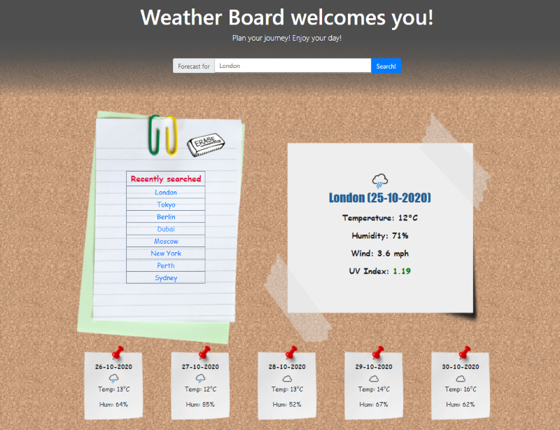
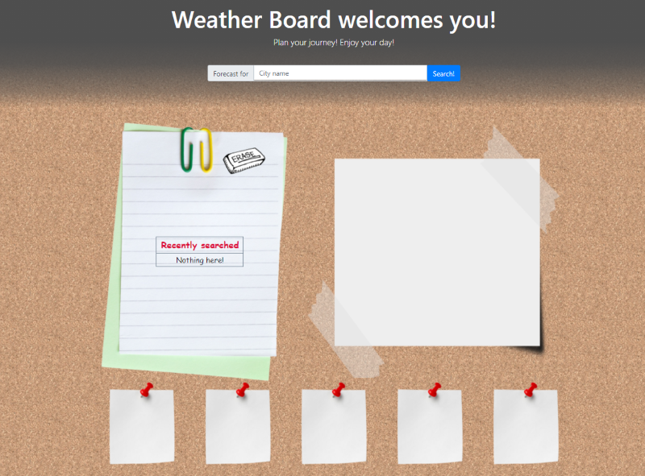
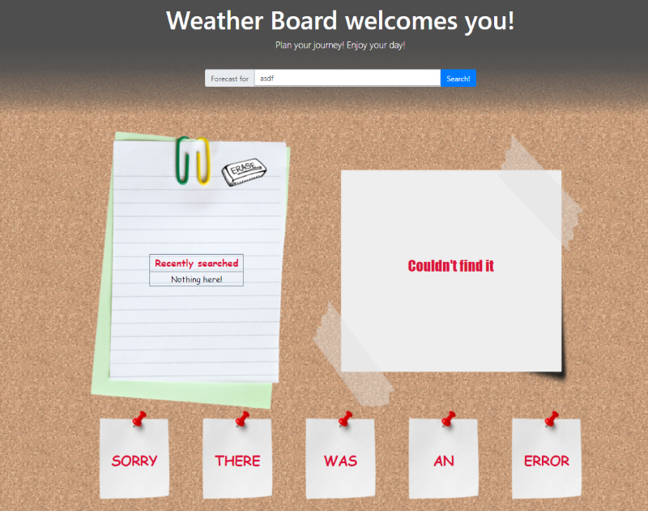
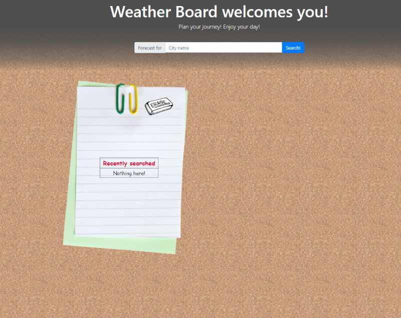

# Weather Board
## Table of content
* [About](#about-the-project)
* [Usage](#usage)
  * [What does it do?](#what-does-it-do)
  * [How to use?](#how-to-use)
  * [Access](#Access)
* [Improvements](#Improvements)
  *[Animations](#Animations)
* [Built with](#built-with)
* [Acknowledgements](#Acknowledgements)
* [Images](#Images)
* [Contact me](#contact-me)
## About the project
Weather Board is a simple application that will search for weather forecast for the city specified by the user. Application is based on javascript, is running in the browser and is using OpenWeather API. Fully responsive layout is mostly based on Bootstrap, but some CSS @media are added to improve the responsiveness even further.  
Important: I noticed strange behavior of the icons sometimes showing wrong weather status. Please report if you can find similar issues.  
## Usage
### What does it do?
Application fetches data from OpenWeather and write it onto specific elements of the page. Searched cities (if found successfully) are stored on history list which capacity is limited to 8 elements. Next search will cause the last element on the list to get discarded. Also, all the elements on history list are hyperlinks that will search the clicked city once again and bring the newest reported data. Erase button will cause to clear the whole search history as well as current search results.
    

One of the details shown on the screen is UV index. The values presented in color are:
* Green - index below 2 (safe)
* Yellow - index between 2 and 5
* Orange - index between 5 and 7
* Red - index between 7 and 10
* Violet - index above 10 (extreme)  

Recommended values were found on [Wikipedia](https://en.wikipedia.org/wiki/Ultraviolet_index). Link to full Global Solar UV Index work is [HERE](https://www.who.int/uv/publications/en/UVIGuide.pdf).
### How to use?
    

User can use search bar on top of the page to specify the name of the city to get forecast for. After pressing search button the app will do it's magic to bring some details to the user.
    

If the name is incorrect, missing in database or there is other issue on the way, the app will display it to the user. After pressing erase button or simply searching again (if search was successfull this time), all will go back to normal and the forecast will be displayed.  
### Access
Website can be directly accessed on [GitGub Pages](https://pavn93.github.io/06-Weather-Dashboard/).  
The source code can be find on GitHub itself [https://github.com/PavN93/06-Weather-Dashboard.git](https://github.com/PavN93/06-Weather-Dashboard.git).  
## Improvements
* I'm planning to add some animations on page load and possibly in the event of using erase button.
* One major improvement would be further develop responsiveness of the 5-days weather. Instead collapsing it into column make a slider so all days will be displayed on some sort of "carousel".  
* Another idea is to make the search bar to stick to the top of the page and thus, make it possible for the mobile user to search again at any point of the page without scrolling back to the top.    

### Animations  
One of the potential improvements is actually on it's way to be implemented properly. At the moment of writing, animations are successfully added, but there are issues where one animation can affect the other. The bug can be revealed in a situation when the refresh page is initiated and during the animation of loading details onto the board, erase button is used. That won't stop the loading animation to stop, but it will start removing cards from the board which will cause the already invisible card to reappear empty. It work exactly the same the other way. When erase button is pressed and new city is searched quickly enough, some cards are displayed after search button click, but the hidding animation is in process which cause already shown cards to disappear. Applied temporary solution is to speed the animations up so the user has less time to react and provoke the bug to show up.
    

## Built with
* [Visual Studio Code](https://code.visualstudio.com/)
* [jQuery](https://jquery.com/)
* [Moment js](https://momentjs.com/)
* [Bootstrap](https://getbootstrap.com/)
* JavaScript
* HTML
* CSS
## Acknowledgements
* [W3Schools](https://www.w3schools.com/)
* [StackOverflow](https://stackoverflow.com/)
* [Markdown Cheat Sheet](https://www.markdownguide.org/cheat-sheet/)
* [api.jquery.com](https://api.jquery.com/)
* Ben Ashley - my tutor who helped me with further understanding jQuery, Moment js and OpenWeather API.

## Images
Transparent images used in this project are found on:  
* [flyclipart.com](flyclipart.com)
* [toppng.com](toppng.com)    

Icons were found on [https://github.com/yuvraaaj/openweathermap-api-icons
](https://github.com/yuvraaaj/openweathermap-api-icons
)  
Background pattern downloaded from [www.toptal.com](www.toptal.com).  
I tried my best to add all the sources used in this project. If any website, creator or author were ommitted, please contact me.

## Contact me
Pawel Nawoj  
email: paweln993@gmail.com